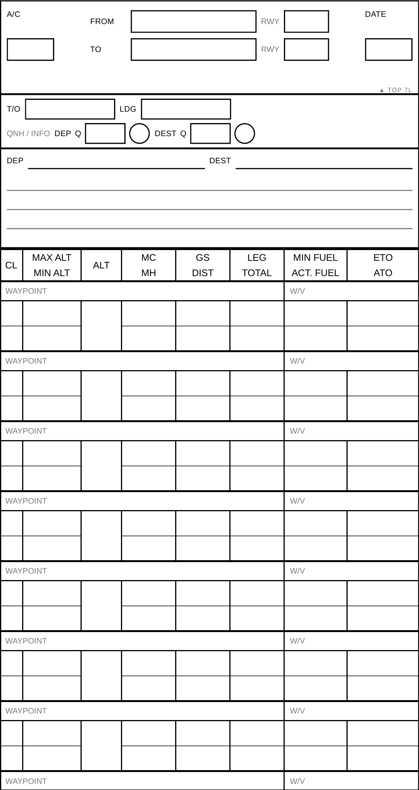

# VFR Nav Log — Kneeboard Template

A compact VFR navigation log that prints **three slips to a landscape A4 sheet**,
duplex, and cuts into **93 × 175 mm** double-sided slips. Sized for the
[Design4Pilot KB-1 mini](https://www.design4pilots.de/) kneeboard: a cut slip
clears the clamp at the top and the clear foil's seam at the bottom, so it slides
right under the foil, and the spare ones stow there too and do not flap around
in a draughty cockpit.



The form is designed around two awkward facts about small kneeboards.

**The clamp's wire handle lies flat on the sheet, and it is a loop, not a bar.**
An upper bar along the top edge, a lower bar 15.5–20 mm down, and two side rails
joining them at roughly 14–20 mm and 77–81 mm from the left edge. So the header
is laid out *around* it rather than under it:

```
    0 ┌──────┬────────────────────────────────┬──────┐
      │ A/C  │  FROM [    ] RWY [ ]           │ DATE │   the strips outside
      │ [  ] │  TO   [    ] RWY [ ]           │ [  ] │   the rails are clear
   15 ├──────┼────────────────────────────────┼──────┤   of the handle; the
   20 │      └────────────────────────────────┘ ▲TOP │   middle shows through
   21 ├───────────────────────────────────────────---┤   its open window
      │  T/O [        ]   LDG [        ]             │   first write-on block
```

Nothing is hidden. The blank strip is where the lower bar lands, and the `▲ TOP`
mark tucks into its right-hand corner, past the rail.

**The usable height is fixed by the clamp above and the foil seam below.**
175 mm is what fits, with a millimetre to spare for the cut. Everything you
actually write in the air — take-off and landing times, QNH, the ATIS letter —
starts at 21 mm, clear of the handle entirely.

## Two variants

The blocks above the nav table are identical in both, and so is the table's
overall height. They differ only in how that height is divided:

| variant | legs | data row | for |
|---|---|---|---|
| [`7L`](build/NavLog-A4-3up-7L.pdf) | 7 legs, 8 waypoints | 5.6 mm | longer routes, neater handwriting |
| [`6L`](build/NavLog-A4-3up-6L.pdf) | 6 legs, 7 waypoints | 6.6 mm | fewer, larger cells — easier in turbulence |

Each slip says which one it is, faintly, next to the `▲ TOP` mark. Print both and
fly them before deciding.

## Print it

Grab a PDF from the table above and print with:

| setting | value |
|---|---|
| paper | A4, plain |
| orientation | landscape |
| scale | **100 % / actual size** — *not* "fit to page" or "shrink to fit" |
| duplex | two-sided, **flip on short edge** |
| margins | none / minimum (the PDF already has 17.5 × 5 mm) |

Scaling is the one that bites: at "fit to page" the slips come out a few
millimetres narrow and stop matching the clamp.

**Check the flip before you cut.** Every slip prints a faint `▲ TOP` in its top
right corner. Hold a printed sheet up to the light — the `▲ TOP` marks on both
sides must be at the *same* end. If the back is upside down, either switch the
duplex option to the other edge, or print the `-longedge` PDF next to it, which
is the same document with the back page pre-rotated.

Expect the front and back to be a millimetre out of register vertically anyway:
that is the printer's duplex feed, not the layout, and no page geometry fixes it.
Cut on the lines of whichever side you can see, and keep the frame's 0.25 mm
width as your slack.

## Cut it

Cut along the thin frame around each slip. The three slips are laid out
symmetrically on the page — equal margins left and right, equal top and bottom —
so the front and back register exactly and one cut goes through both sides
cleanly. Slip pitch is 97 mm (93 mm slip + 4 mm gutter).

Six slips per printed sheet: three fronts and three backs, giving you three
double-sided nav logs, or one out-and-back per slip.

## The form

```
┌──────┬───────────────────────────┬───────┐  ─┐  0 mm
│ A/C  │ FROM [      ] RWY [    ]  │ DATE  │   │ clamp zone —
│ [  ] │ TO   [      ] RWY [    ]  │ [   ] │   │ ground info only
│      └───────────────────────────┘▲TOP 7L│   │
│      (blank: the wire's lower bar)       │  ─┘  21 mm
├──────────────────────────────────────────┤
│  T/O [        ]   LDG [        ]         │  first block clear
│  QNH/INFO  DEP Q [  ] ◯   DEST Q [  ] ◯  │  of the clamp
├──────────────────────────────────────────┤
│  DEP _________     DEST _________        │  frequencies,
│  ______________________________________  │  then free text:
│  ______________________________________  │  FIS, fuel, mass,
│  ______________________________________  │  squawk, clearance
│  ______________________________________  │
├────┬─────┬───┬────┬────┬────┬─────┬──────┤
│ CL │ MAX │ALT│ MC │ GS │LEG │ MIN │ ETO  │
│    │ MIN │   │ MH │DIST│TOT │ ACT │ ATO  │
├────┴─────┴───┴────┴────┴────┴─────┴──────┤
│  waypoint / notes              │ W/V     │
│  .. 7 or 6 of these, over two data rows  │
├──────────────────────────────────────────┤
│  waypoint                      │ W/V     │  destination:
└──────────────────────────────────────────┘  no leg data   175 mm
```

| field | what goes in it |
|---|---|
| `FROM` / `TO` / `RWY` | departure and destination, each with its runway. Centred in the clamp handle's open window |
| `A/C` / `DATE` | for filing the slip after the flight. Out at the edges, where no part of the handle reaches |
| `T/O` / `LDG` | actual times, written in the cockpit |
| `QNH  Q [ ]` | last two digits — the leading ones are obvious in context |
| `◯` | the ATIS information letter, circled |
| `DEP` / `DEST` freq | tower or info frequency at each end |
| free lines | en-route FIS and any other frequencies — then whatever else the flight needs written down: fuel and mass, squawk, a clearance |
| `CL` | airspace class letter (C / D / E / R). Optional, but it makes the altitude limits next to it mean something |
| `MAX ALT` / `MIN ALT` | the airspace band you have to stay inside |
| `ALT` | planned cruising altitude for the leg |
| `MC` / `MH` | magnetic course and heading |
| `GS` / `DIST` | planned groundspeed and leg distance — your in-flight cross-check |
| `LEG` / `TOTAL` | leg time and accumulated time en route |
| `MIN FUEL` / `ACT. FUEL` | fuel required at this point, and what the gauge says |
| `ETO` / `ATO` | estimated and actual time overhead. Minutes alone is usually enough |
| waypoint row | the waypoint, plus whatever the leg needs (`! EDR A15`, `≈ Weser`, `→ Alsfeld`) |
| `W/V` | wind direction/speed, e.g. from SkyDemon. Optional |
| last row | the destination: a name and the landing wind, no data cells |

The figures under a waypoint describe the leg **leaving** it, so the last
waypoint needs no data cells — the form ends with a bare name row. That gives
**seven legs and eight waypoints** on `7L`, six and seven on `6L`. Typical
cross-country routes use four to six, so either has room to spare without
wasting a whole slip on blank grid.

## Customise it

Everything dimensional lives in the `:root` block at the top of
[`src/navlog.css`](src/navlog.css) — slip size, the height of each block, and
the eight column widths. The free-text block under the frequencies takes up
whatever height is left over, so changing any other block does not cascade into
retuning everything else, and the table always ends flush with the bottom cut
line.

A few you might want:

```css
--slip-h: 175mm;      /* what fits the KB-1 mini between clamp and foil seam */
--h-clamp: 21mm;      /* below the wire handle's lower bar */
--w-clamp-side: 10.5mm; /* the A/C and DATE strips, outside the side rails */
--w-wire-gap: 8mm;    /* the gaps the side rails sit in */
--h-freq-min: 20mm;   /* floor for the free-text block, not its actual height */
--c-eto: 16mm;        /* the eight column widths must add up to --slip-w */
```

The four clamp dimensions are hardware, not taste — they are traced from where
the wire handle actually lies. Measure your own board, put the numbers in the
`WIRE_*` block in [`tools/check.py`](tools/check.py), and `make check` will tell
you which part of the header now fouls which part of the handle, in millimetres,
until the CSS agrees.

Leg count and row heights live in the `VARIANTS` tuple in
[`tools/build.py`](tools/build.py) — add or edit one and it builds its own pair
of PDFs. Ask for more legs and the free-text block shrinks to compensate; ask
for more than fits and the block hits its floor and `make check` fails, rather
than the grid quietly sliding off the paper.

If you change a column width, run `make check` — it will tell you if the columns
no longer add up and the grid has drifted off the cut line.

## Build it

Needs Python and [WeasyPrint](https://weasyprint.org/).

```sh
pip install weasyprint pypdf
make          # -> build/navlog-*.html and four PDFs
make check    # assert the geometry still matches this README
make preview  # regenerate docs/preview-*.png
```

`src/slip.html` is the single source of truth for the form — one slip, with the
waypoint block written once. `tools/build.py` stamps it out three times per
page, two pages, once per variant, and inlines the CSS into
`build/navlog-<tag>.html`. That generated file is self-contained, so you can also
just open it in a browser and print from there; the result is close, though a
browser's own margin handling makes the PDF the more reliable route.

`make check` asserts, for every variant, what this README promises: two A4
landscape pages, three 93 × 175 mm slips each, 97 mm pitch, symmetric margins,
nothing overhanging a cut line, no label or box in the clamp zone touching any
of the four strips the wire handle covers, the first write-on block starting
below it, the right number of legs and waypoint rows, and the table ending flush
with the bottom cut line. Paper forms
fail quietly — a column 2 mm too wide still renders, it just stops lining up —
so the numbers are pinned in code rather than in prose alone.

## What changed from the spreadsheet version

The original was an `.xlsx` ([`legacy/NavLog.xlsx`](legacy/NavLog.xlsx), kept
for reference). Changes in this version, all driven by what actually got
scribbled into the margins of real flights:

- **Clamp zone.** T/O, LDG and the frequencies moved out from under the clamp,
  and then the header was rebuilt around the wire handle rather than beneath it:
  `FROM` / `TO` / `RWY` stacked into the loop's open window, `A/C` and `DATE` out
  in the clear strips beside the side rails. Nothing is hidden any more.
- **`A/C` and `DATE`** became boxes instead of ruled lines, being narrow columns
  now rather than a full-width row.
- **Height.** 175 mm rather than the sheet's full reach, so a cut slip passes
  under the kneeboard's clear foil instead of standing 9 mm proud of its seam.
- **QNH and the ATIS letter** got printed fields instead of being squeezed into
  the blank area.
- **Runways** got boxes next to `FROM` / `TO` instead of being crammed in after
  the ICAO code.
- **`W/V`** got a labelled slot at the end of each waypoint row.
- **Airspace class** got a narrow `CL` box, instead of drawing one by hand
  around the letter each time.
- **`TIME` split** into `LEG` and `TOTAL`.
- **A fifth free line** under the frequencies. The old sheet had five 6.35 mm
  rows there; an early draft of this version cut it to four and put two ruled
  notes lines at the bottom instead. Both notes lines have been given back: one
  restored the fifth free line, the other became the destination row below.
- **The destination row is back.** The old sheet ended page 1 with a bare
  `WAYPOINT:` at row 33 — deliberately, since the figures under a waypoint
  describe the leg leaving it and nothing leaves the last one. An early draft of
  this version mistook that for a page-break accident and dropped it, which cost
  a whole three-row block to write one airfield name. Seven legs and eight
  waypoints, as before, on the `7L` variant.
- Plain-text source: the layout is now diffable and builds reproducibly, instead
  of depending on how Excel or LibreOffice feels about rendering the sheet.

Column order and the top/bottom split of every existing field are unchanged, so
the form still reads the way it always did.

## Contact

Questions, bug reports, or a tweak that would make this fit your own kneeboard
better — please [open an issue](../../issues) or a pull request here on GitHub.

## Licence

[](https://creativecommons.org/publicdomain/zero/1.0/)

Everything here — the form, the build tools, the PDFs — is released into the
public domain under [CC0 1.0
Universal](https://creativecommons.org/publicdomain/zero/1.0/). No copyright, no
attribution, no conditions. Print it, sell it, change it, fold it into something
else, relicense it, claim it as your own. You owe nobody anything.

Where a jurisdiction does not allow copyright to be surrendered — Germany, for
one — CC0 falls back to an unconditional, irrevocable, royalty-free licence to
do all of the above for the full term of the rights (§3, *Public License
Fallback*), so the practical effect is the same everywhere. Note that CC0 does
not touch trademark or patent rights (§4a), and comes with no warranty.

Full text in [`LICENSE`](LICENSE).

## Not a legal document

This is a piece of paper for organising your own planning. It is not an approved
form and it replaces nothing: check your own figures, and comply with whatever
your operating rules and the aircraft flight manual actually require.
